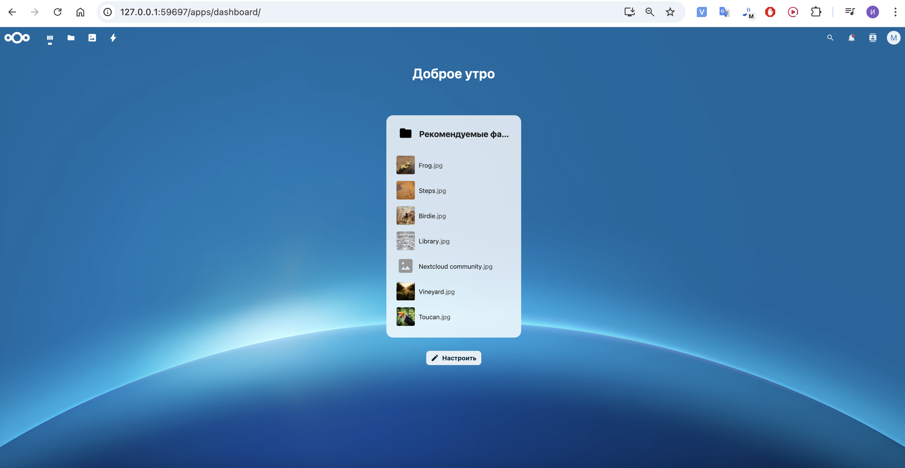

# k8s Проект

## Ход выполнения:
- ### 1. туннелирование трафика

- ### 2. nextcloud

- ### 3. minikube dashboard

## Ответы на вопросы
### 1. Про порядок выполнения Манифестов

- Да, порядок важен.

- Если мы создадим Deployment до ConfigMap, контейнер PostgreSQL не сможет получить нужные переменные среды (например, POSTGRES_DB, POSTGRES_USER, POSTGRES_PASSWORD), что приведёт к ошибке при запуске Pod. Kubernetes не будет автоматически "ожидать" создания ConfigMap, и контейнер начнёт перезапускаться с ошибками.

- Однако, если мы запустим Service до Deployment, ничего критичного не произойдёт, так как Service будет ожидать, пока поды, соответствующие селекторам, появятся в системе.

### 2. Про уменьшение кол-ва реплик
- Если уменьшить количество реплик postgres-deployment до 0, база данных станет недоступной, и Nextcloud утратит возможность подключения. При возврате масштаба до 1 Nextcloud сможет видеть postgres, но не восстанавливает подключение автоматически, поэтому потребуется перезапустить PODы Nextcloud.