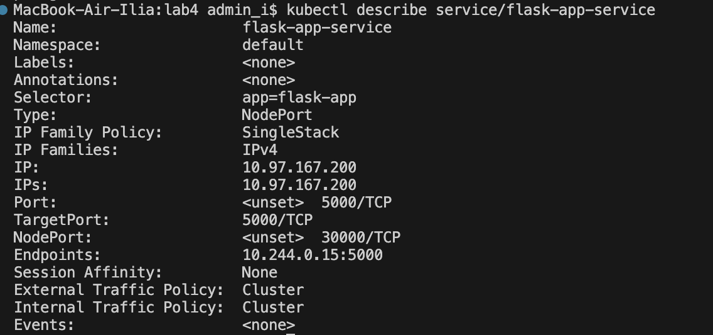
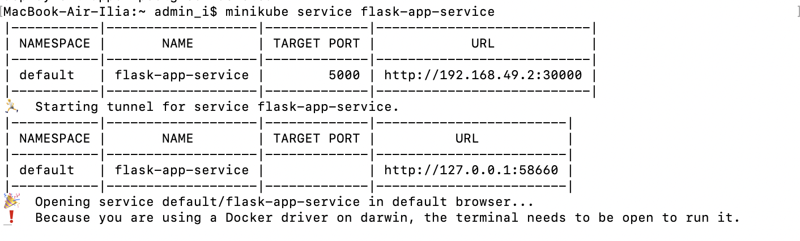
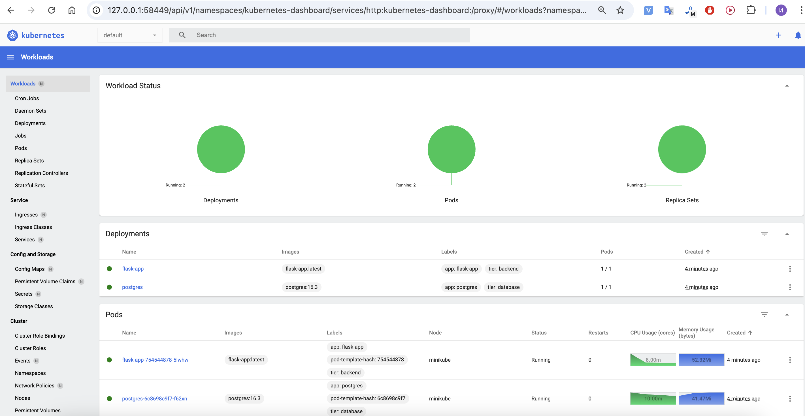
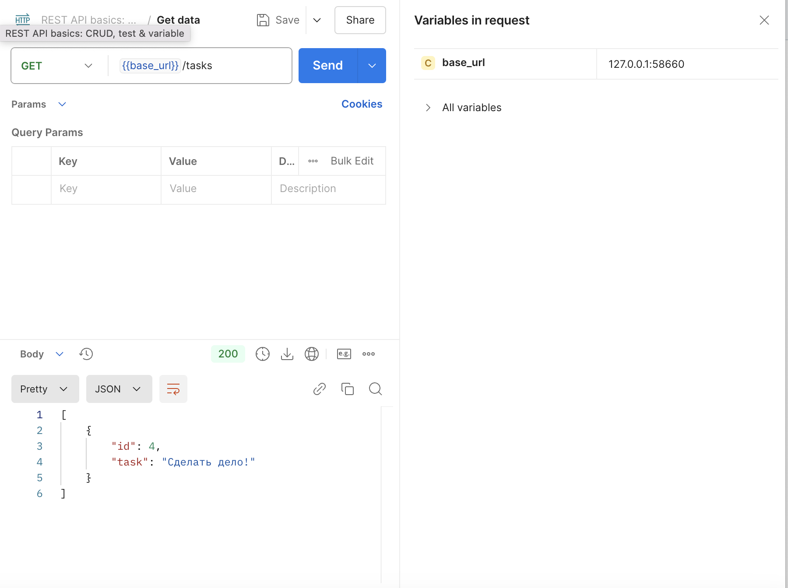

# Cвой k8s Проект

## Описание конфигурации

Данная конфигурация включает в себя следующие компоненты:

- Два Deployment'а:
  - PostgreSQL 
  - Flask-приложение
- Кастомный образ для Flask-приложения
- Init-контейнер в Flask Deployment для ожидания готовности PostgreSQL
- Volume для PostgreSQL (PersistentVolumeClaim)
- ConfigMap и Secret для конфигурации
- Services для обоих компонентов
- Liveness и Readiness пробы для обоих сервисов
- Дополнительные лейблы (tier: database/backend)

## Инструкция по запуску

Для запуска проекта необходимо выполнить следующие шаги:

1. Убедиться, что установлены все необходимые инструменты:
   - Docker
   - Minikube
   - kubectl
   - bash

2. Клонировать репозиторий с проектом

3. Перейти в директорию проекта:
   ```bash
   cd lab4
   ```

4. Запустить Minikube, если он не запущен:
   ```bash
   minikube start
   ```

5. Собрать и загрузить Docker-образ приложения и применить все конфигурационные файлы:

    ```bash
   source deploy.sh
   ```
   Либо:
   ```bash
   docker build -t flask-app:latest ./app
   minikube image load flask-app:latest
   ```
   ```bash
   kubectl apply -f postgres-secret.yml
   kubectl apply -f app-configmap.yml
   kubectl apply -f postgres-deployment.yml
   kubectl apply -f postgres-service.yml
   kubectl apply -f app-deployment.yml
   kubectl apply -f app-service.yml
   ```
   


7. Получить доступ к приложению:
   ```bash
   minikube service flask-app-service
   ```
   

8. Запустить Dashboard
    ```bashs
    minikube dashboard --url
    ```
    

9. Пользоваться!
    
